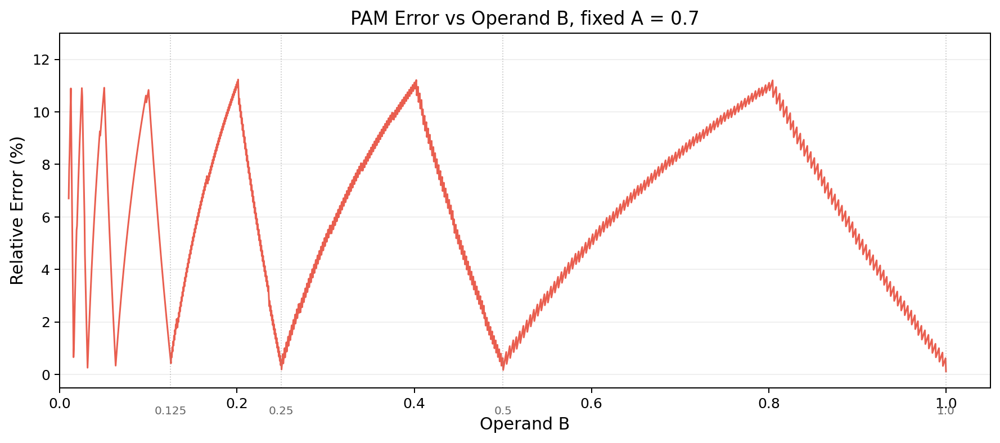
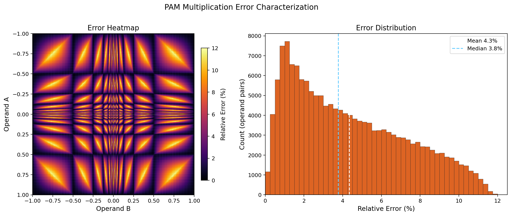

# Systolic Array using PAM Multiplication

Matrix multiplication systolic array using [Piecewise Affine Multiplication](https://www.mdpi.com/2079-9292/11/12/1913) written in Verilog

PAM is an approximate floating point multiplication trick. It relies on the fact that the IEEE 754 FP representation when interpreted as an integer approximately encodes `log2(|x|)`. This allows us to do approximate multiplication only using integer addition/subtraction.

PAM can allow us to perform AI inference using far lower circuit complexity and energy usage, without sacrificing too much accuracy.

This project uses that trick to create a MAC (multiply-and-accumulate) unit that has significantly lower complexity than a true MAC unit. That MAC is then organized into a 2D systolic array for matrix multiplication (TPU style).

## PAM Explained
IEEE 754 encodes real numbers in terms of mantissa and exponent like so:

$$
A = (1 + M_A) \times 2^{E_A - bias}
$$
$$
B = (1 + M_B) \times 2^{E_B - bias}
$$

True multiplication is written as:

$$
A \times B = (1 + M_A) \cdot (1 + M_B) \times 2^{E_A + E_B - bias}
$$

$$
= (1 + M_A + M_B + M_A \cdot M_B) \times 2^{E_A + E_B - bias}
$$

For PAM approximate multiplication, add the 2 as integers and subtract bias:

$$
A \times B \approx I_A + I_B - bias = (1 + M_A + M_B) \times 2^{E_A + E_B - bias} 
$$

We can see that the two terms are almost identical, and only the $M_A \cdot M_B$ term is missing. That's our approximation error.

## PAM Error Characterized
Since the error term only depends on the mantissa values of the operands, the error is small and periodic

  
   
  <em>Approximation error as we sweep one operand and hold the other constant</em>

 

Worst case error is 11.9%

If we sweep both operands we can see the overall picture:

  
   
  <em>Approximation error as we sweep both operands</em>

 

The mean error is 4.3%, and 62% of pairs have under 5% error

## Future Work
### Measure matmul error:
In $W.X$ matrix multiplication, which is common in AI inference workloads, individual approximation errors can cancel out when summing values across a row.

The final impact of PAM multiplication might be much lower than 11%, and a full LLM simulation needs to be done to measure it
